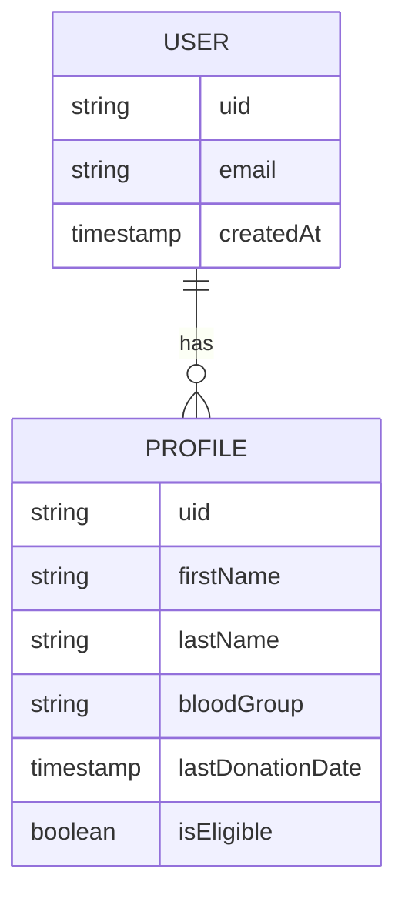
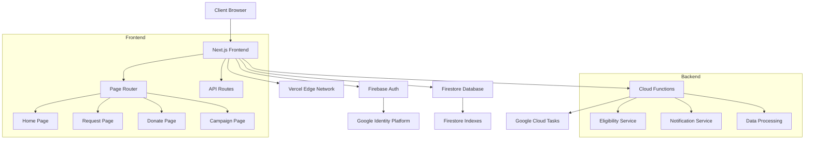
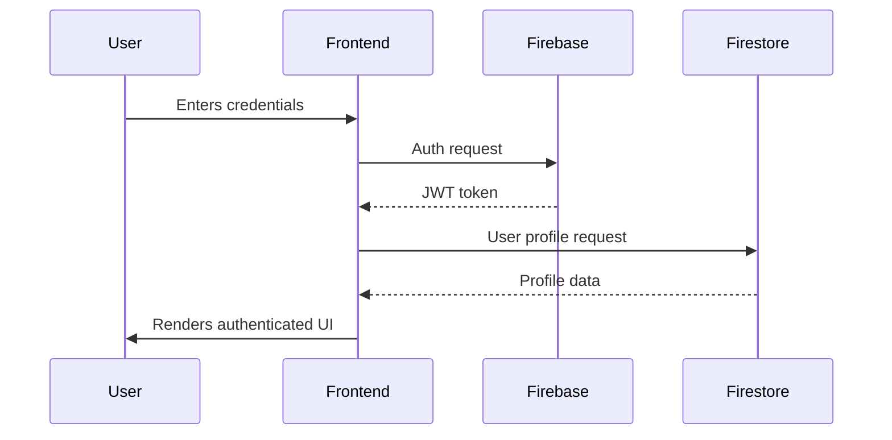

# Blood Donation System - Technical Documentation

## Abstract
This document provides comprehensive technical documentation for the Blood Donation System, a university graduation project built using Next.js and Firebase. The system facilitates blood donation management, donor eligibility checks, and emergency request handling.

## Team Members and Contributions
### Supervised by:
**Dr. Mohamed Osman**

### Team Members:
1. Youssef Mohamed Abdelfattah Elmorali
2. Ahmed Mohamed Abdelsalam Essa
3. Bassant Mahmoud Mohamed Rakha
4. Gamila Omar Nasr Ali
5. Ahmed Samir Thabet Gad El Rabb
6. Mohamed Osama Awad Ali Awad

## Problem Statement
Current blood donation systems often lack real-time donor availability tracking and automated eligibility verification. This system addresses these challenges by:
- Providing real-time donor matching
- Automating eligibility checks based on medical history
- Streamlining emergency request handling

## Solution Overview
The system implements:
- Firebase authentication for secure user access
- Firestore for real-time data management
- Next.js for server-side rendering and API routes
- Automated eligibility calculations based on donation history

## System Features
### Core Features:
1. **Donor Registration & Screening** - with dynamic eligibility logic
2. **Inventory Management** - live blood stock monitoring
3. **Emergency Requests** - instant alerts to matching donors

### Implemented Features
1. **User Authentication**
   - Email/password login with Firebase Auth
   - Role-based access control (admin/donor)
   - JWT token management for session persistence
   - Password reset functionality
2. **Donor Profile Management**
   - Personal information storage in Firestore
   - Blood type tracking with validation
   - Comprehensive donation history with timestamps
   - Profile picture storage in Firebase Storage
3. **Eligibility System**
   - Calculates next eligible donation date based on:
     * Last donation date
     * Medical conditions
     * Weight and hemoglobin levels
   - Real-time eligibility status updates
4. **Page Functionalities**
   - **Home Page**:
     * Displays urgent blood requests
     * Shows donation statistics
     * Provides quick access to key features
   - **Request Blood Page**:
     * Form for hospitals to request blood
     * Real-time donor matching algorithm
     * Request status tracking
   - **Donate Page**:
     * Appointment scheduling system
     * Eligibility pre-check form
     * Donation center locator
   - **Campaign Page**:
     * Blood drive event management
     * Donor registration system
     * Campaign analytics dashboard

### Future Features
1. Emergency request notification system
2. Campaign management module
3. Advanced analytics dashboard

## Technical Stack
### Frontend Implementation
- **Next.js 14** with App Router
- **React Hook Form** & **Zod** for form validation
- **Shadcn UI** for component styling
  * Server-side rendering for critical pages
  * Dynamic route handling for campaigns
  * API routes for custom endpoints
- **React** with hooks
  * Custom hooks for Firebase integration
  * Context API for global state
  * Optimized component structure
- **TypeScript**
  * Strict typing for all components
  * Interface definitions for Firestore data
- **Tailwind CSS**
  * Responsive design system
  * Dark mode support
  * Custom theme configuration

### Backend Implementation
- **Firebase Auth** - secure user authentication
- **Firebase Hosting** - fast and secure app delivery

### Dev Tools:
- **Vercel Analytics** - for performance insights
  * Custom claims for role management
  * Auth state persistence
  * Email verification flow
- **Firestore Database**
  * Optimized data structure with subcollections
  * Real-time listeners for critical data
  * Security rules implementation
- **Firebase Storage**
  * Secure file uploads
  * Image compression
  * Access control
- **Cloud Functions**
  * Background triggers for data processing
  * Scheduled functions for eligibility updates
  * HTTP endpoints for external services

## Entity Relationship Diagram


## System Architecture
### Detailed Component Diagram


### Authentication Flow


## Key Implementation Snippets
### Authentication Flow
```typescript
// From useAuth.tsx
export const AuthProvider: React.FC<AuthProviderProps> = ({ children }) => {
  const [user, setUser] = React.useState<User | null>(null);
  const [userProfile, setUserProfile] = React.useState<UserProfile | null>(null);
  // ... auth state management logic
};
```

### Firebase Initialization
```typescript
// From client.ts
const firebaseConfig: FirebaseOptions = {
  apiKey: process.env.NEXT_PUBLIC_FIREBASE_API_KEY,
  authDomain: process.env.NEXT_PUBLIC_FIREBASE_AUTH_DOMAIN,
  // ... other config
};
```

## Testing Approach
- Unit tests for utility functions
- Integration tests for auth flow
- Manual testing for UI components

## Challenges and Solutions
1. **Firebase Emulator Setup**
   - Solution: Created environment-controlled initialization
2. **Real-time Profile Updates**
   - Solution: Implemented Firestore listeners in auth provider

## Future Enhancements
1. Push notifications for emergency requests
2. Donor reward system
3. AI-powered donor matching

## References
1. Firebase Documentation
2. Next.js Documentation
3. Material UI Component Library