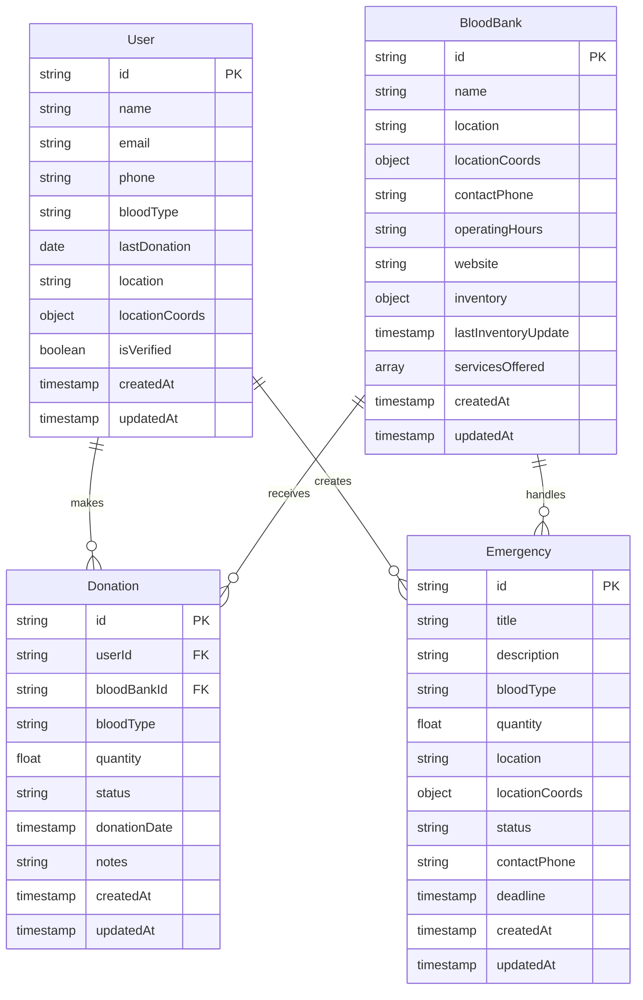

# Blood Donation System - Entity Relationship Diagram

## Entity Descriptions

### User
- Represents blood donors and users of the system
- Stores personal information and donation history
- Tracks blood type and last donation date
- Includes location information for mapping

### BloodBank
- Represents blood donation centers and hospitals
- Stores location and contact information
- Maintains inventory of different blood types
- Tracks operating hours and services offered

### Donation
- Records individual blood donations
- Links users to blood banks
- Tracks donation status and quantity
- Includes timestamps for tracking

### Emergency
- Represents urgent blood requests
- Includes required blood type and quantity
- Tracks location and deadline
- Links to users and blood banks

## Relationships
- Users can make multiple donations
- Blood banks can receive multiple donations
- Users can create multiple emergency requests
- Blood banks can handle multiple emergency requests 