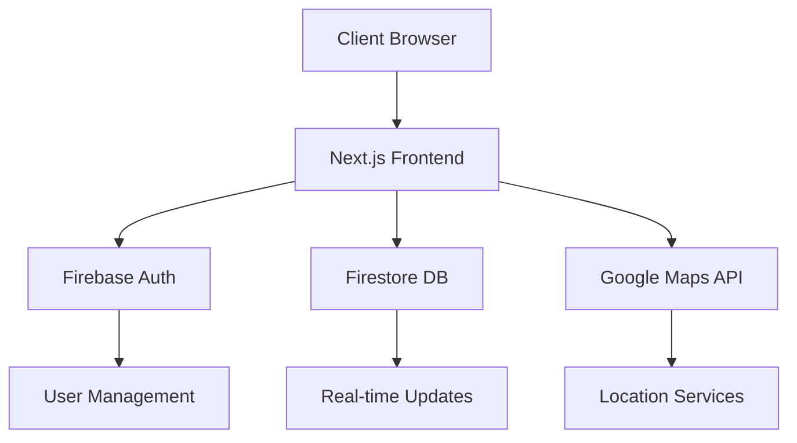
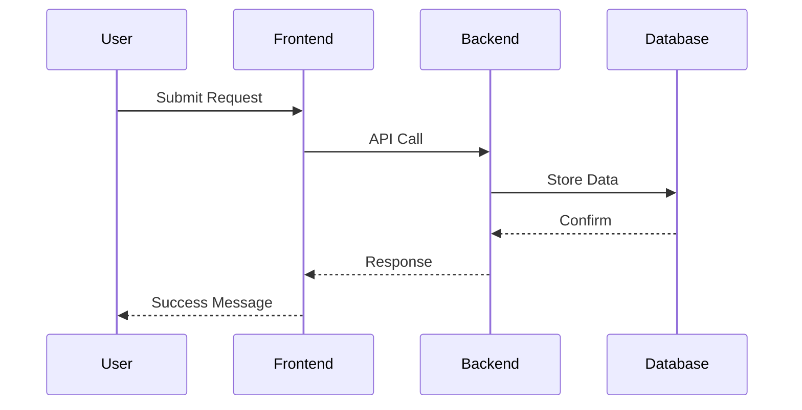
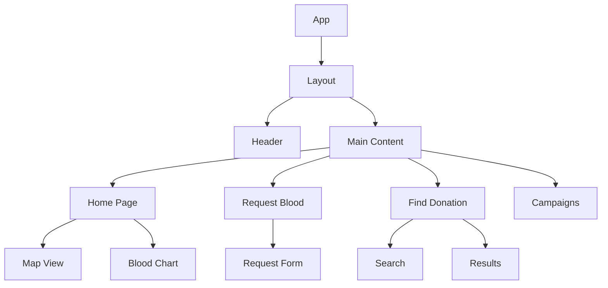
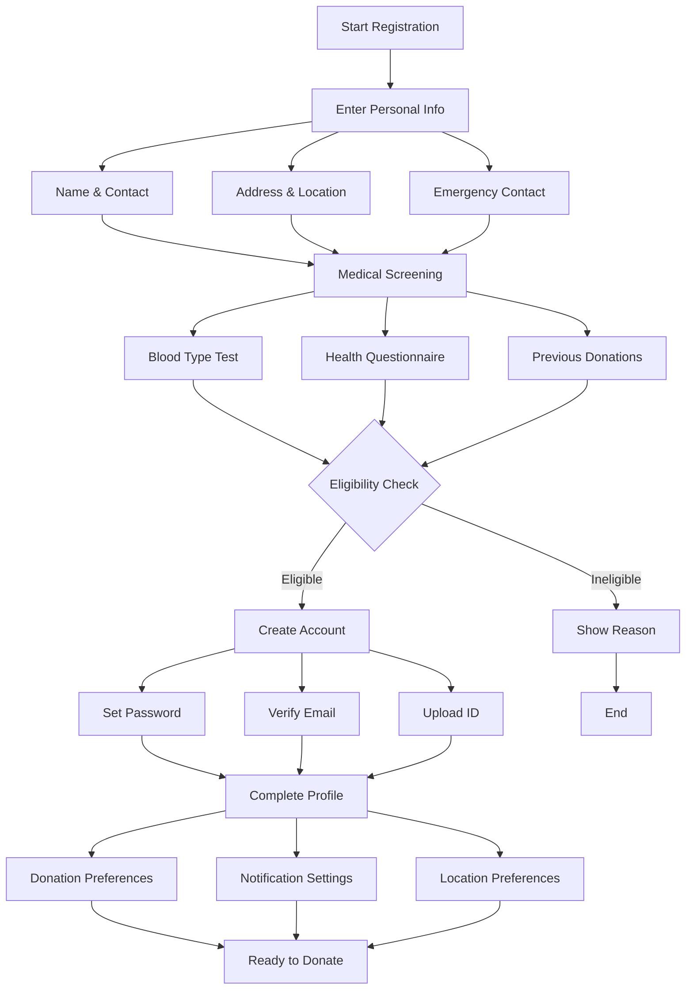
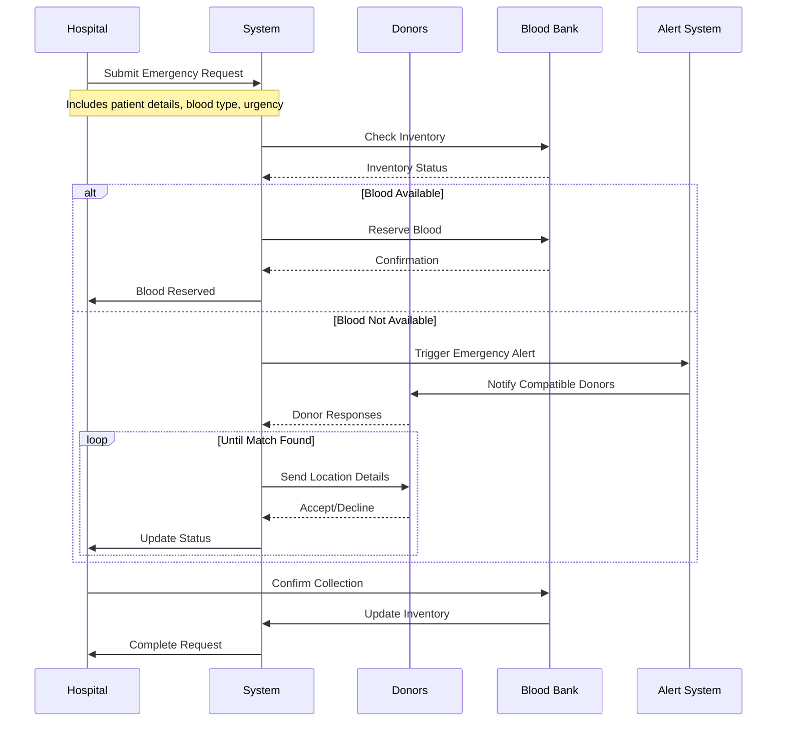
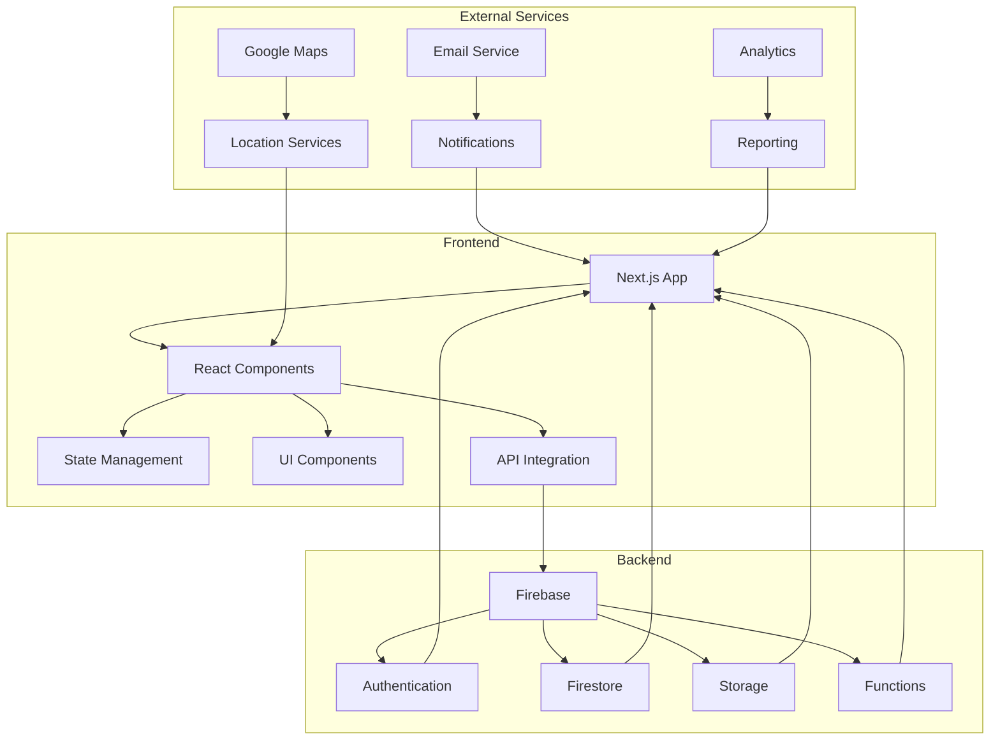
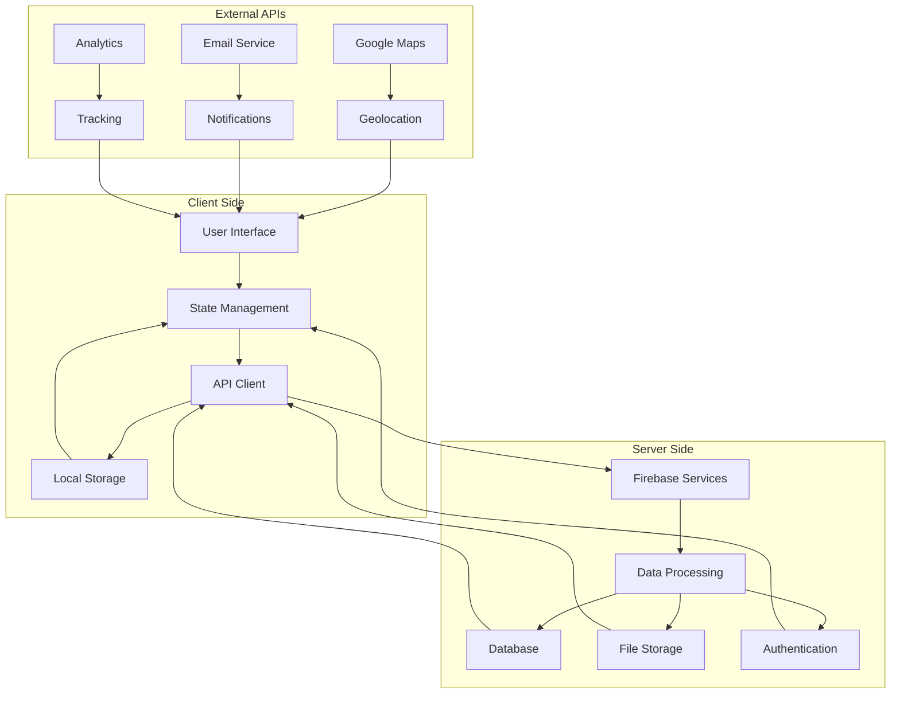
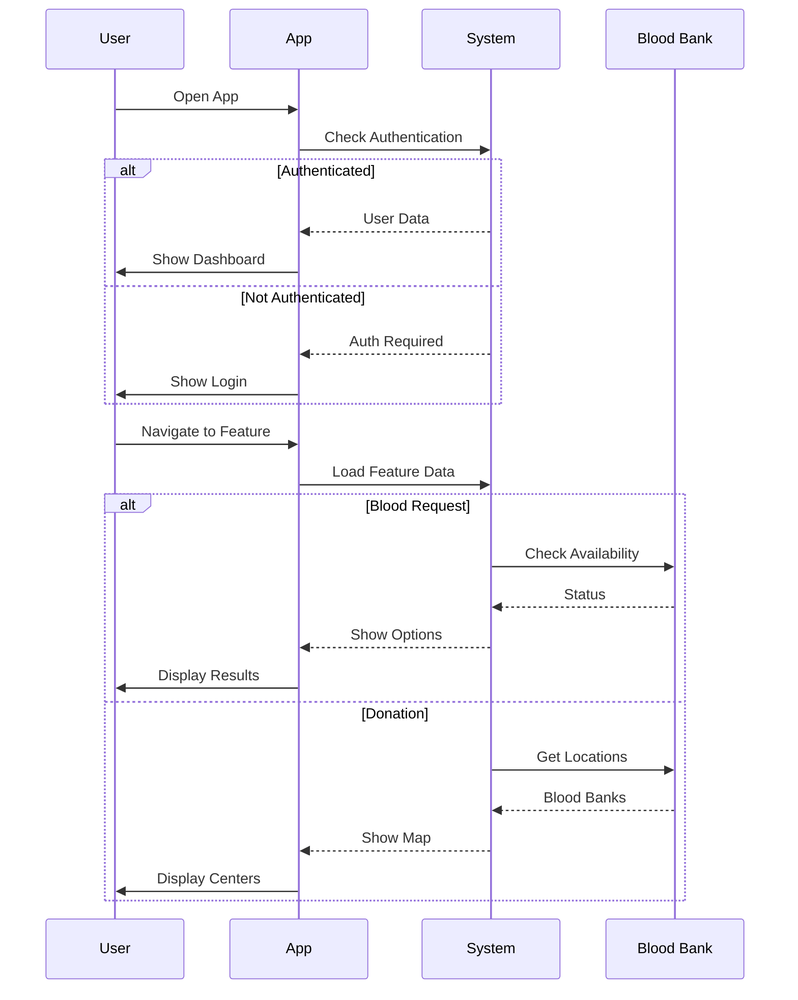

# Qatrah Hayat - Blood Donation Management System

## Table of Contents
1. Abstract
2. Project Overview
3. Solution Overview
4. System Overview
5. Technical Implementation
6. Challenges and Solutions
7. Future Enhancements
8. Conclusion
9. Acknowledgements

## Abstract
Qatrah Hayat is a modern blood donation management system built with Next.js and Firebase, designed to connect donors with blood banks and streamline the blood donation process. The system features real-time tracking, emergency response coordination, and an intuitive user interface that makes blood donation more accessible and efficient.

## Project Overview

### Core Features
- Real-time blood bank location tracking
- Emergency blood request management
- Donor registration and eligibility screening
- Blood type compatibility checking
- Campaign management
- User authentication and profile management

### Key Pages
1. Home Page (`/`)
   - Emergency requests display
   - Quick access to donation centers
   - Blood type compatibility chart
   - Donation statistics

2. Request Blood Page (`/request-blood`)
   - Blood request form
   - Emergency request handling
   - Request tracking
   - Blood type compatibility information

3. Find Donation Page (`/find-donation`)
   - Interactive map of blood banks
   - Search and filter functionality
   - Real-time availability updates
   - Distance-based sorting

4. Campaign Page (`/campaigns`)
   - Campaign creation and management
   - Donor engagement tracking
   - Campaign analytics
   - Event scheduling

### Technical Stack
- Frontend: Next.js 14, React, TypeScript
- UI: Shadcn UI, Tailwind CSS
- Backend: Firebase (Authentication, Firestore, Storage)
- Maps: Google Maps API
- State Management: React Context, Custom Hooks

## Solution Overview

### Frontend Architecture
```typescript
// Example of a custom hook for blood requests
export function useBloodRequest() {
  const [loading, setLoading] = useState(false);
  const { user } = useAuth();
  const { toast } = useToast();

  const submitRequest = async (requestData: BloodRequest) => {
    setLoading(true);
    try {
      const docRef = await addDoc(collection(db, "blood_requests"), {
        ...requestData,
        userId: user.uid,
        status: "pending",
        createdAt: serverTimestamp(),
      });
      toast({
        title: "Request Submitted",
        description: "Your blood request has been submitted successfully.",
      });
      return docRef.id;
    } catch (error) {
      toast({
        title: "Error",
        description: "Failed to submit request. Please try again.",
        variant: "destructive",
      });
      throw error;
    } finally {
      setLoading(false);
    }
  };

  return { submitRequest, loading };
}
```

### Backend Structure
```typescript
// Example of Firebase security rules
rules_version = '2';
service cloud.firestore {
  match /databases/{database}/documents {
    match /blood_requests/{requestId} {
      allow read: if request.auth != null;
      allow create: if request.auth != null;
      allow update: if request.auth != null && 
        (request.auth.uid == resource.data.userId || 
         request.auth.token.isAdmin == true);
    }
  }
}
```

## System Overview

### Component Architecture
```typescript
// Example of a reusable map component
export default function MapView({ 
  locations, 
  onLocationSelect,
  center = { lat: 30.0444, lng: 31.2357 },
  zoom = 12 
}: MapViewProps) {
  const { isLoaded, loadError } = useMaps();
  
  if (loadError) {
    return <MapError error={loadError} />;
  }

  return (
    <Card className="relative h-[600px] overflow-hidden">
      <GoogleMap
        mapContainerStyle={containerStyle}
        center={center}
        zoom={zoom}
        options={{
          styles: mapStyles,
          gestureHandling: 'greedy',
          disableDefaultUI: true,
          zoomControl: true,
        }}
      >
        {locations.map((location) => (
          <Marker
            key={location.id}
            position={location.coordinates}
            title={location.name}
            onClick={() => onLocationSelect?.(location)}
          />
        ))}
      </GoogleMap>
    </Card>
  );
}
```

### Database Schema
```typescript
// Example of TypeScript interfaces for data models
interface BloodRequest {
  id: string;
  patientName: string;
  bloodType: string;
  units: number;
  urgency: string;
  hospital: string;
  contactName: string;
  contactPhone: string;
  additionalNotes: string;
  status: string;
  createdAt: Date;
  operationNumber: string;
  userId: string;
  updatedAt: Timestamp;
}

interface BloodBank {
  id: string;
  name: string;
  address: string;
  coordinates: {
    lat: number;
    lng: number;
  };
  phone: string;
  email: string;
  bloodInventory: {
    [key: string]: number; // blood type -> quantity
  };
  operatingHours: {
    [key: string]: string; // day -> hours
  };
}
```

## Technical Implementation

### Authentication Flow
```typescript
// Example of authentication context
export function AuthProvider({ children }: { children: ReactNode }) {
  const [user, setUser] = useState<User | null>(null);
  const [loading, setLoading] = useState(true);

  useEffect(() => {
    const unsubscribe = onAuthStateChanged(auth, (user) => {
      setUser(user);
      setLoading(false);
    });

    return () => unsubscribe();
  }, []);

  return (
    <AuthContext.Provider value={{ user, loading }}>
      {!loading && children}
    </AuthContext.Provider>
  );
}
```

### Real-time Updates
```typescript
// Example of real-time blood inventory updates
export function useBloodInventory(bankId: string) {
  const [inventory, setInventory] = useState<BloodInventory | null>(null);

  useEffect(() => {
    const unsubscribe = onSnapshot(
      doc(db, "blood_banks", bankId),
      (doc) => {
        if (doc.exists()) {
          setInventory(doc.data() as BloodInventory);
        }
      }
    );

    return () => unsubscribe();
  }, [bankId]);

  return inventory;
}
```

## Challenges and Solutions

### 1. Google Maps Integration
Challenge: Handling ad blocker interference with Google Maps loading
Solution: Implemented graceful fallback and user guidance
```typescript
// MapsProvider with error handling
export function MapsProvider({ children }: { children: ReactNode }) {
  const { isLoaded, loadError } = useLoadScript({
    googleMapsApiKey: process.env.NEXT_PUBLIC_GOOGLE_MAPS_API_KEY!,
    libraries,
    preventGoogleFontsLoading: true,
  });

  if (loadError) {
    return (
      <Alert variant="destructive">
        <AlertCircle className="h-4 w-4" />
        <AlertDescription>
          Unable to load Google Maps. Please check your ad blocker settings.
        </AlertDescription>
      </Alert>
    );
  }

  return (
    <MapsContext.Provider value={{ isLoaded, loadError }}>
      {children}
    </MapsContext.Provider>
  );
}
```

### 2. Real-time Data Synchronization
Challenge: Maintaining consistent state across multiple clients
Solution: Implemented Firebase real-time listeners with optimistic updates

## Future Enhancements

1. Mobile Application
   - React Native implementation
   - Push notifications
   - Offline support

2. AI Integration
   - Predictive analytics for blood demand
   - Smart donor matching
   - Automated inventory management

3. Healthcare System Integration
   - Hospital management system integration
   - Electronic health record compatibility
   - Automated eligibility verification

## Conclusion

Qatrah Hayat represents a significant advancement in blood donation management, leveraging modern web technologies to create an efficient and user-friendly platform. The system's real-time capabilities, intuitive interface, and robust architecture make it a valuable tool for healthcare institutions and donors alike.

## Acknowledgements

Special thanks to the development team and all contributors who made this project possible. The system's success is a testament to the power of modern web technologies in addressing critical healthcare needs.

## Diagrams

### System Architecture


### Data Flow


### Component Hierarchy


## Security Implementation

### Authentication & Authorization
```typescript
// Example of protected route implementation
export function ProtectedRoute({ children }: { children: ReactNode }) {
  const { user, loading } = useAuth();
  const router = useRouter();

  useEffect(() => {
    if (!loading && !user) {
      router.push('/auth/signin');
    }
  }, [user, loading, router]);

  if (loading) {
    return <LoadingSpinner />;
  }

  return user ? <>{children}</> : null;
}
```

### Data Security
```typescript
// Example of data encryption for sensitive information
export async function encryptSensitiveData(data: string): Promise<string> {
  const encoder = new TextEncoder();
  const dataBuffer = encoder.encode(data);
  const key = await crypto.subtle.generateKey(
    { name: "AES-GCM", length: 256 },
    true,
    ["encrypt", "decrypt"]
  );
  const iv = crypto.getRandomValues(new Uint8Array(12));
  const encryptedData = await crypto.subtle.encrypt(
    { name: "AES-GCM", iv },
    key,
    dataBuffer
  );
  return btoa(String.fromCharCode(...new Uint8Array(encryptedData)));
}
```

## Testing Strategy

### Unit Tests
```typescript
// Example of a unit test for blood request validation
describe('BloodRequest Validation', () => {
  it('should validate required fields', () => {
    const request = {
      patientName: '',
      bloodType: 'A+',
      units: 0
    };
    
    const result = validateBloodRequest(request);
    expect(result.isValid).toBe(false);
    expect(result.errors).toContain('Patient name is required');
  });

  it('should validate blood type format', () => {
    const request = {
      patientName: 'John Doe',
      bloodType: 'Invalid',
      units: 2
    };
    
    const result = validateBloodRequest(request);
    expect(result.isValid).toBe(false);
    expect(result.errors).toContain('Invalid blood type');
  });
});
```

### Integration Tests
```typescript
// Example of an integration test for the donation flow
describe('Donation Flow', () => {
  it('should complete full donation process', async () => {
    // Setup test data
    const donor = await createTestDonor();
    const bloodBank = await createTestBloodBank();
    
    // Start donation process
    const request = await createDonationRequest(donor.id, bloodBank.id);
    
    // Verify request status
    expect(request.status).toBe('pending');
    
    // Complete donation
    const completed = await completeDonation(request.id);
    
    // Verify final state
    expect(completed.status).toBe('completed');
    expect(completed.bloodBank.inventory[donor.bloodType]).toBeGreaterThan(0);
  });
});
```

## Deployment Strategy

### CI/CD Pipeline
```yaml
# Example GitHub Actions workflow
name: Deploy Qatrah Hayat

on:
  push:
    branches: [ main ]

jobs:
  deploy:
    runs-on: ubuntu-latest
    steps:
      - uses: actions/checkout@v2
      
      - name: Setup Node.js
        uses: actions/setup-node@v2
        with:
          node-version: '18'
          
      - name: Install Dependencies
        run: npm ci
        
      - name: Run Tests
        run: npm test
        
      - name: Build
        run: npm run build
        
      - name: Deploy to Firebase
        uses: FirebaseExtended/action-hosting-deploy@v0
        with:
          repoToken: '${{ secrets.GITHUB_TOKEN }}'
          firebaseServiceAccount: '${{ secrets.FIREBASE_SERVICE_ACCOUNT }}'
          channelId: live
          projectId: qatrah-hayt-vw1o
```

### Environment Configuration
```typescript
// Example of environment configuration
export const config = {
  development: {
    apiUrl: 'http://localhost:3000/api',
    firebaseConfig: {
      // Development Firebase config
    }
  },
  production: {
    apiUrl: 'https://api.qatrah-hayt.com',
    firebaseConfig: {
      // Production Firebase config
    }
  }
}[process.env.NODE_ENV || 'development'];
```

## User Flows

### Detailed Donor Registration Flow


### Detailed Emergency Request Flow


### System Architecture Flow


### Data Flow Architecture


### User Interaction Flow


## Performance Optimization

### Code Splitting
```